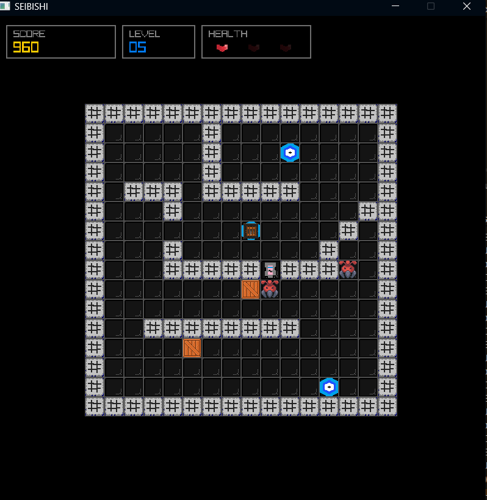
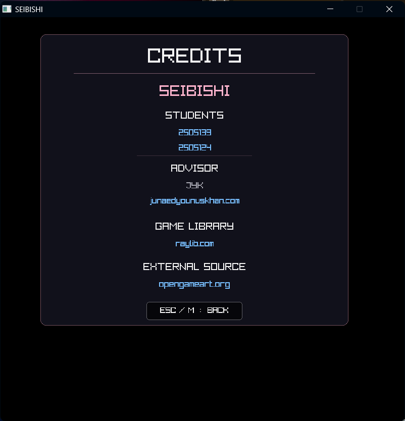

# SEIBISHI

<p align="center">
  <strong>A 16×16 tile-based puzzle game with enemies, progressive difficulty, scoring, and persistent game data.</strong>
</p>

<p align="center">
  Built in C with raylib.
</p>

---

## 🎮 About

**SEIBISHI** is a tile-based puzzle game developed in C using the
[raylib](https://www.raylib.com/) library.

The game combines puzzle solving with enemy avoidance. Players navigate
through progressively more difficult levels, interact with boxes and goals,
manage their health, and avoid enemies whose behavior becomes increasingly
challenging as the game progresses.

The game contains **10 levels** with three difficulty modes:

- Easy
- Normal
- Hard

---

## ✨ Features

- 10 handcrafted levels
- 16×16 tile-based game board
- Three difficulty modes
- Progressive enemy difficulty
- Enemy line-of-sight detection
- Enemy pursuit behavior
- Predictive enemy movement in later levels
- Player health system
- Score system
- Level-based scoring
- Level progression
- Save and load system
- Persistent player profile
- Persistent settings
- Music mute/unmute
- Adjustable music volume
- Leaderboard persistence
- Instructions screen
- Credits screen
- Functional external hyperlinks
- Game Over and Victory screens

---

## 🕹️ Gameplay

The objective is to complete the level by solving the puzzle while avoiding
enemies.

Players must:

1. Navigate through the level.
2. Interact with boxes and goals.
3. Reach the required goals.
4. Avoid enemy collisions.
5. Manage their health.
6. Progress through increasingly difficult levels.

Enemy behavior changes throughout the game. Earlier levels use simpler
movement, while later levels introduce more persistent pursuit and
predictive movement.

---

## 📈 Difficulty

### Easy

Designed for a more forgiving experience with simpler enemy behavior.

### Normal

Provides the standard gameplay experience with stronger enemy pursuit.

### Hard

Introduces more aggressive enemy behavior and predictive movement,
requiring more careful positioning and planning.

---

## 🧠 Enemy System

SEIBISHI uses lightweight grid-based enemy behavior rather than complex
pathfinding algorithms.

Enemy behavior includes:

- Random movement
- Line-of-sight player detection
- Direct pursuit
- Direction-based player prediction
- Different behavior depending on the current level

Enemy count also increases as the game progresses.

This keeps the enemy system appropriate for the game's 16×16 grid while
allowing difficulty to scale across the 10 levels.

---

## 🏆 Scoring

The game uses a score system based on player actions and successful goal
completion.

- Goal completion awards points.
- Movement can affect the score.
- Enemy collisions can result in a score penalty.
- Level score is tracked separately from the overall score.

Completed games can be recorded in the leaderboard.

---

## ❤️ Health

The player starts with three hearts.

Colliding with an enemy reduces health.

If the player's health reaches zero, the game ends.

When the player survives a collision, the current level is reset while
appropriate progress and penalties are preserved.

---

## 💾 Save & Load

SEIBISHI supports interrupted-game saving.

Game state includes information such as:

- Current level
- Player state
- Board state
- Enemy state
- Enemy count

Saved game data is stored locally in:

---

### Credits


```text
assets/logfiles/save.txt
